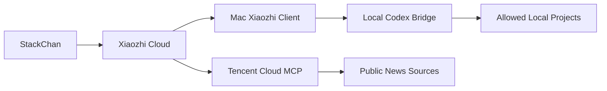

# Cloud MCP Plan

This document defines the split between always-online cloud tools and Mac-local tools for StackChan.

## Direction

Use Tencent Cloud for stable, read-only or internet-facing tools. Keep Mac-local execution on the Mac.



## Cloud-Safe Tools

Good candidates:

- Daily finance/news briefing.
- Weather and alerts.
- Calendar or reminder reads.
- Public knowledge lookups.
- Account-independent project status pages.

Avoid on the first cloud service:

- Codex control.
- Local filesystem access.
- Private project source reads.
- Shell command execution.
- Long-lived personal tokens without a proxy or secret manager.

## First Test Service

The first cloud service is `src/cloud-news-server.js`.

It exposes:

- `GET /healthz`
- `GET /sources`
- `GET /briefing`
- `POST/GET /mcp`

MCP tools:

- `news_daily_briefing`
- `news_list_sources`

The service fetches public RSS sources, caches results for a short time, and returns a Chinese spoken briefing suitable for StackChan.

## Deployment Sketch

1. Clone the repository on Tencent Cloud.
2. Install Node.js 20+.
3. Run `npm ci`.
4. Start the service:

```bash
HOST=0.0.0.0 PORT=8788 npm run start:cloud-news
```

5. Put HTTPS in front of it with Nginx or a Tencent Cloud load balancer.
6. Add the HTTPS `/mcp` URL to Xiaozhi MCP config.
7. Ask StackChan to call the news briefing tool.

## Recommended Split

Cloud MCP:

- Stable daily features.
- Read-only internet data.
- Future queue/control-plane APIs.

Mac MCP:

- Codex execution.
- Local project allowlist.
- Local thread status.
- Anything requiring user filesystem or app access.

This keeps the robot useful when the Mac is offline while preserving local-machine safety.
